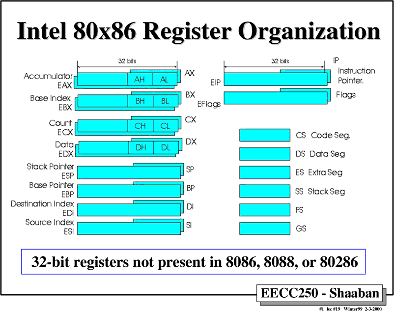
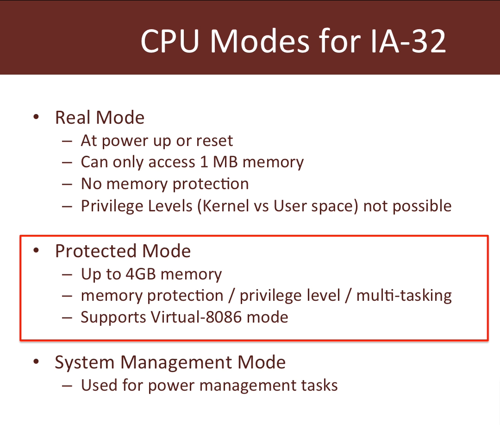
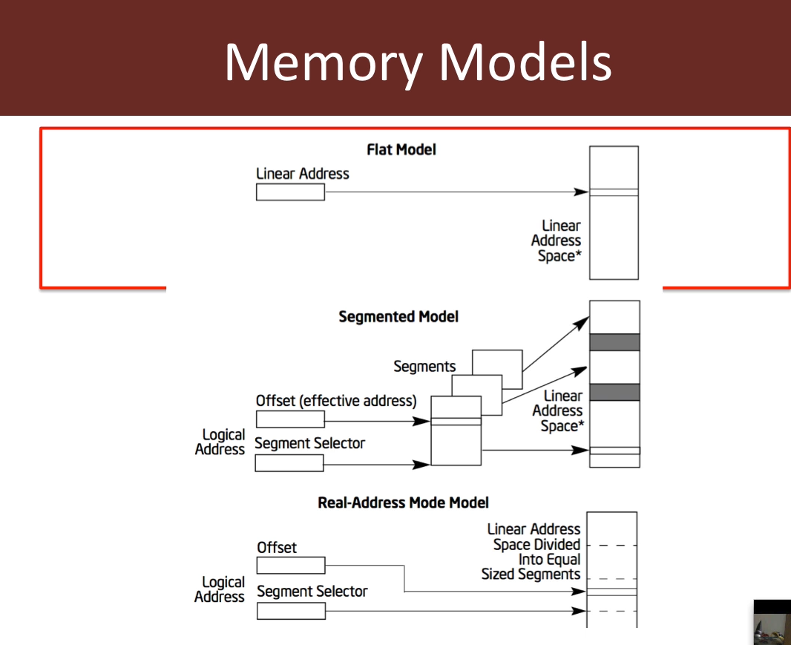
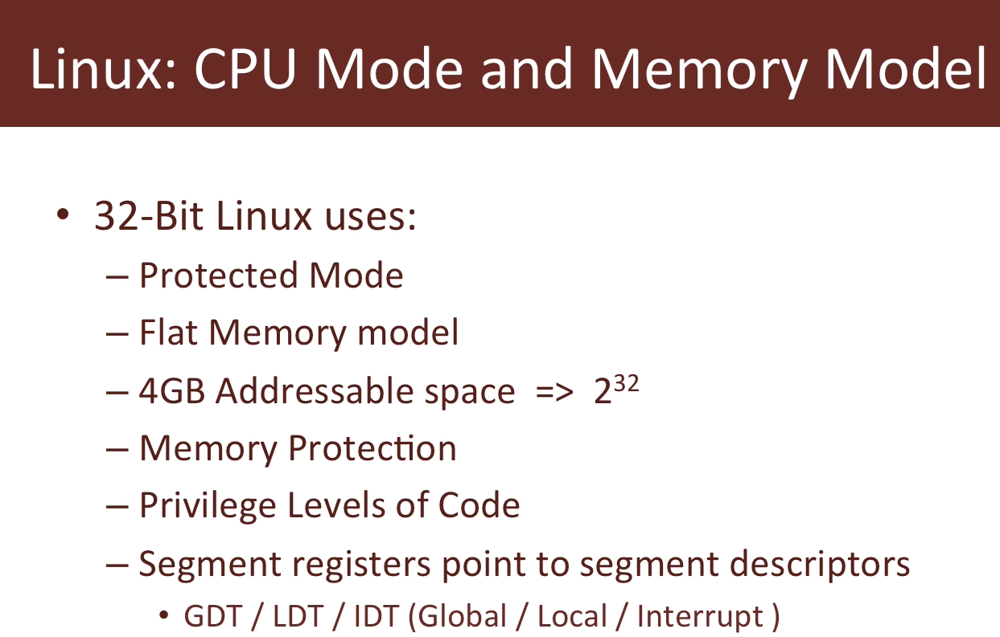
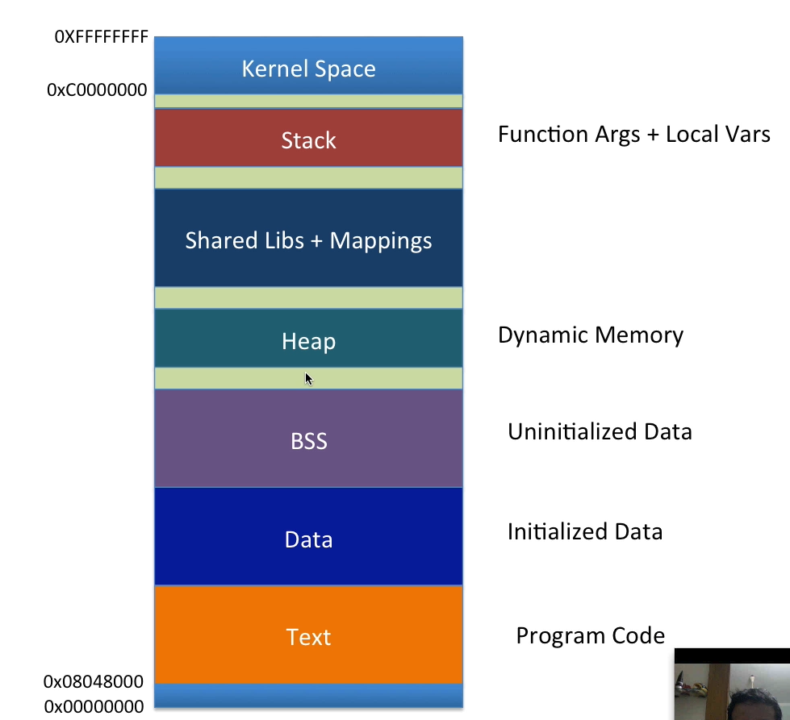
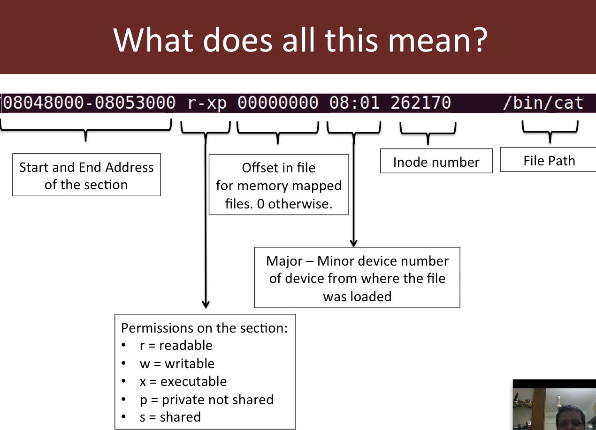
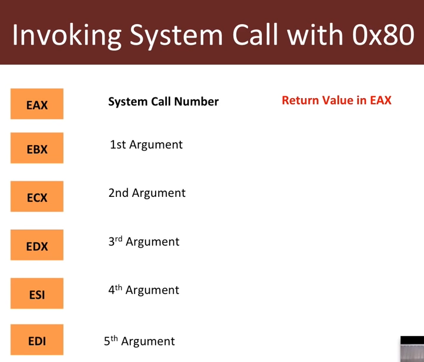
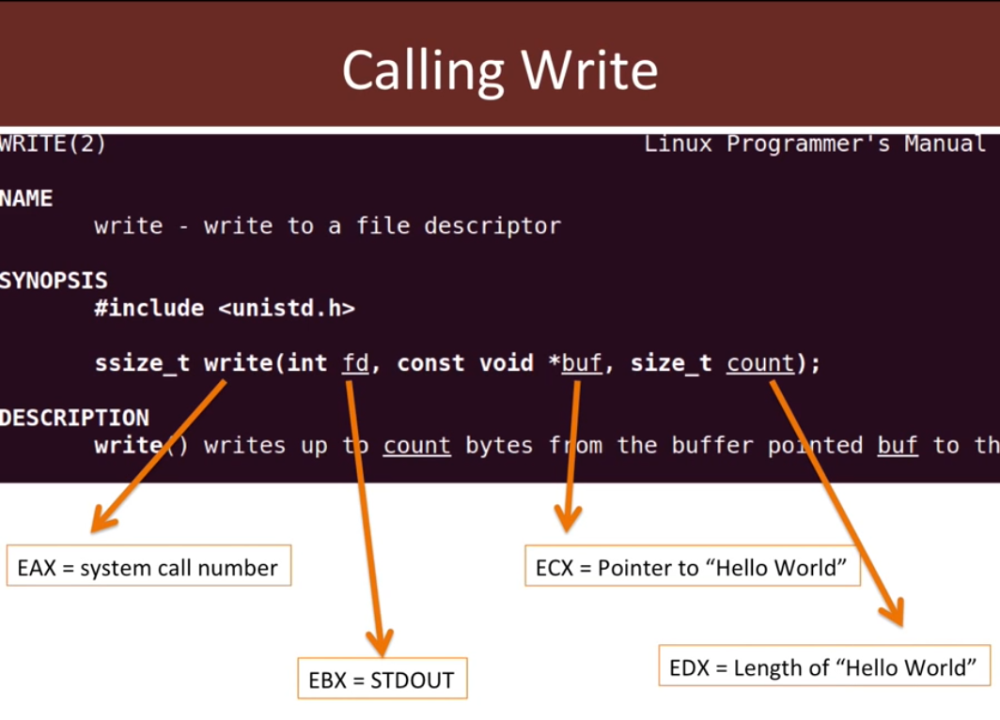

# x86 Assembly Language and Shellcoding on Linux - Pentester Academy (study notes)

## Know your cpu

```Shell
>> lscpu
>> cat /proc/cpuifo
```

## General Purpose registers



## Investegating CPU registers

```Shell
# First attach gdp to a running process
>> gdp /bin/bash

# set a break point
>> (gdb) break main

# See all CPU registers
>> (gdb) info registers

# See EAX in hex (General purpose flag)
>> (gdb) display /x $ax
>> (gdb) display /x $eax
>> (gdb) display /x $ax
>> (gdb) display /x $ah
```

## Checking which command will run next

```Shell
>> (gdb) disassemble $eip
```

## To see all registers

```Shell
>> (gdb) info all-registers
```

## Change gdb to show Intel syntax instead of AT&T

```Shell
>> (gdb) set disassembly-flavor intel
```

## CPU Modes



## Memory Models



## Linux Mode and memory model



## Memory arch



## Investigating memory of a running process



```Shell
# Get proccess pid
>> ps | grep <process name>
>> cat /proc/<pid>/maps
```

OR

```Shell
>> pmap -d <pid>
```

OR Attach the process to GDB

```Shell
>> (gdb) info proc mappings
```

## Get all system code numbers

```Shell
>> vim /usr/include/i386-linux-gnu/asm/unistd_32.h
```

## Invoking system calls with interupt 0x80




## To see the manual for a system function

```Shell
>> man 2 <func name>
# e.g.
>> man 2 write
```

## Creating our first assembly app

[hello_world.asm](./source/hello_world.asm)

```Shell
# building
>> nasm -f elf32 hello_world.asm -o hello_world.o

# linking
>> ld hello_world.o -o HelloWorld

# running
>> ./HelloWorld

# Debugging
>> gdb ./HelloWorld
>> (gdb) break _start
>> (gdb) run
>> (gdb) set disassembly-flavor intel
>> (gdb) disassemble
>> (gdb) info registers
>> (gdb) stepibb
```
